# Report for SDM274 Assgn05 MLP

# Background

Multiple Layer Perceptron(MLP) is a type of neural network, primarily used in supervised learning. It’s made up of multiple layers of nodes, or neurons, organized into an input layer, one or more hidden layers, and an output layer. Each neuron is connected to every neuron in the previous and following layer (fully connected), and each connection has an associated weight, which is learned during training.

It was initially invented in the 1980s, aimed at addressing problems where linear models were insufficient. By introducing non-linear activation functions and organizing neurons into multiple fully connected layers, MLPs allowed for more sophisticated feature extraction and data representation. As deep learning evolved, MLPs were largely surpassed by more specialized architectures like CNN for image and spatial data, and RNNs for sequential tasks such as language processing. Despite this, MLPs are still widely used in scenarios where simplicity and computational efficiency are prioritized, or as subcomponents in complex architectures.

Furthermore, the concept of the fully connected layer remains fundamental across various modern deep learning models, including CNNs, RNNs, and transformers, where they play a crucial role in transforming high-dimensional data, interpreting features, and synthesizing final outputs, illustrating their enduring importance in deep learning.

## Code Design

## Designing the nonlinear function

```python
def complex_nonlin_func(x):
    return (
        np.sin(x) +
        0.3 * np.exp( np.abs(x)**0.5 )
    )
```

Here I introduced a nonlinear function composed of a sine and an exponential part. It is nonlinear, and not symmetrical, which is hard to approximate using a linear model. 

I generated 500 points on the line, spanning from -10 to 10, and also split the data into (0.7, 0.3) for training and testing.

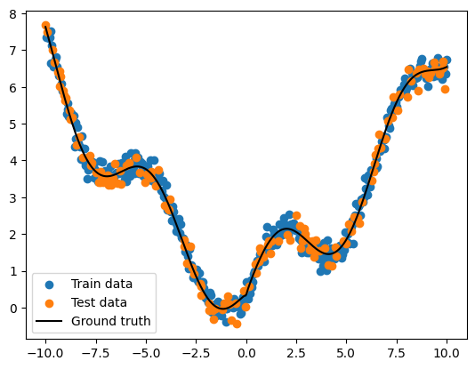

```python
y = y + 0.2 * np.random.normal(size=x.size)
```

I added a random noise with the amplitude of 0.2 to the signal.

### Modules.py resembling torch.nn

I designed a family of class that **resembles the Pytorch Torch.nn library**. This library is well designed for its modularity, ease of use, and flexibility. User can design a network by simply declaring and stacking layers in a list. An **example code snippet of torch.nn code** is provided below:

```python
net = nn.Sequential()
net.add(nn.Dense(256, activation='relu'),
        nn.Dense(10))
net.initialize(init.Normal(sigma=0.01))
```

### modularity

In my designed class, I implement the modularity with **a base class `Module`**. The `Module` class contains shared attributes and methods, like `parameters` (to manage learnable parameters) and caches (`output_cache`, `input_cache`) for forward and backward passes.

```python
class Module:

    def __init__(self):
        self.parameters = []
        self.output_cache = None
        self.input_cache = None
        self.isInference = False

    def forward(self):
        raise NotImplementedError

    def backward(self):
        raise NotImplementedError

    def parameters(self):
        return self.parameters
```

Adding new types of layers or operations is straightforward—I can inherit from `Module` and override the `forward` and `backward` methods as needed.

### caching intermediate values

Implemented layers **caches intermediate values** needed for backpropagation.

For example, `Linear` caches `input_cache` to store inputs during the forward pass. This allows the layer to reuse these inputs during the backward pass for gradient calculations.

### forward and backward methods

Each module implements its **own `forward` and `backward` methods**, essential for differentiable operations in neural networks.

- In `forward`, each layer computes its output based on the input, caching intermediate results if necessary.

- In `backward`, the layers calculate the gradients with respect to their inputs and parameters. For example, `Linear` calculates gradients for weights (`dW`), biases (`db`), and the input (`dX`) to propagate gradients to previous layers.

### How parameters are stored

Layers with learnable parameters, such as `Linear`, define and manage their parameters (weights `W` and biases `b`). These parameters are stored in a dictionary (`self.parameters`) .

> However this design may lead to unwanted re-train if lack proper management

### managing parameters

- The library introduces an `isInference` flag to distinguish between **training and inference modes**. When `isInference` is set to `True`, the forward pass bypasses caching and specific training-only operations.
- The `reset` method in `Linear` layers reinitializes the weights and biases. This can be useful when experimenting with different initializations and hyperparameters.

### *The source code is provided in the appendix*

# Experiment Records

## Design of the Network

I defined a MLP class which inherits from the Module class (which might not be the best choice but it works).

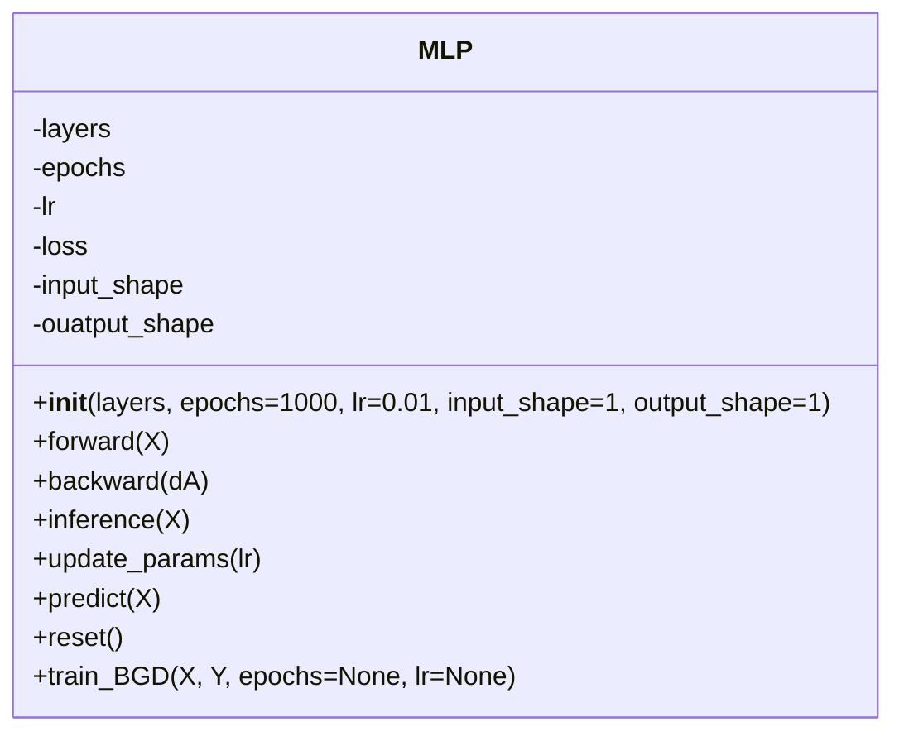

## Initialization

First, initialize the `MLP` class with the desired layers, number of epochs, learning rate, input shape, and output shape. Here is the structure used for training.

```python
layers = [
    Linear(input_size=1, output_size=64),
    ReLU(),
    Linear(input_size=64, output_size=128),
    ReLU(),
    Linear(input_size=128, output_size=256),
    ReLU(),
    Linear(input_size=256, output_size=1)
]

mlp = MLP(layers=layers, epochs=1000, lr=0.01, input_shape=1, output_shape=1)
```

To train the model, call the `train_BGD` method with the input data X and target data `Y`.

```python
X = np.array([...])  # Input data
Y = np.array([...])  # Target data

mlp.train_BGD(X, Y)
```

## Training Steps

1. **Forward Pass**: The `forward` method is called to compute the output of the model for the given input X.
2. **Loss Calculation**: The loss is computed using Mean Squared Error (MSE) between the predicted output and the target `Y`.
3. **Backward Pass**: The `backward` method is called to compute the gradients of the loss with respect to the model parameters.
4. **Parameter Update**: The `update_params` method updates the model parameters using the computed gradients and the learning rate.
5. **Epoch Loop**: Steps 1-4 are repeated for the specified number of epochs.

### *Code provided in the appendix.*

## Fitting

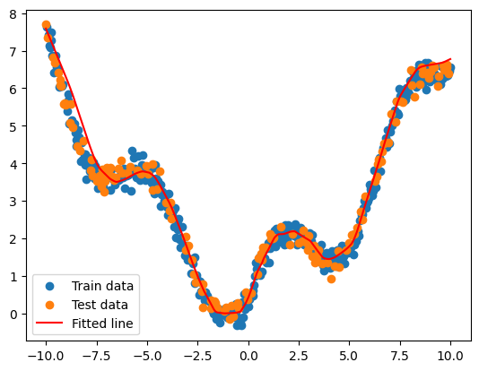

```python
# Creates the model    
mlp_model = MLP(layers, epochs=5000, lr=7)
if not trained:
    # Train the model with the generated data
    mlp_model.train_BGD(X_train, y_train)
    trained = True
elif trained:
    mlp_model.reset()
    mlp_model.train_BGD(X_train, y_train)
```

This image is the result of successful fitting. For the initial version of the Multi-Layer Perceptron (MLP), which lacked any form of regularization, I had to set hyperparameters to rather extreme values in order to achieve satisfactory training performance. This process significantly increased the training time, requiring approximately 2 minutes to complete, which is notably longer compared to the simpler single-neuron models used previously. 

<div style="display: flex; justify-content: center; align-items: center;">
    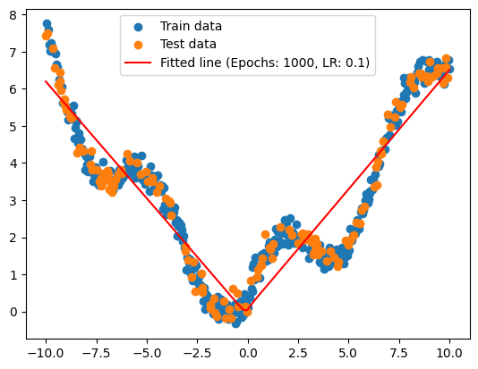
    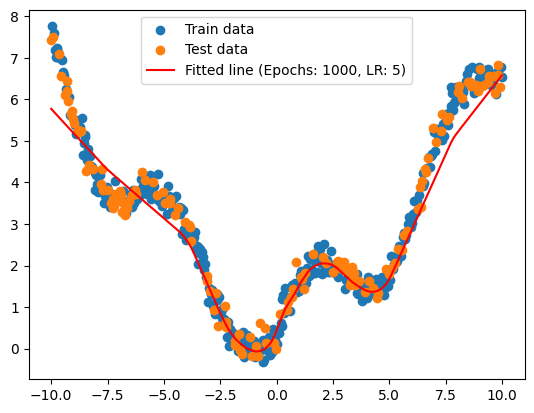
    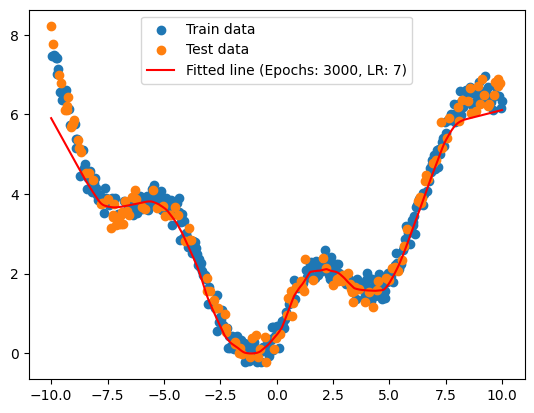
</div>


Some comparations. The MLPs need significantly more resources to train.

## Optimization of structure and training strategy

Empirically, I discovered that a shallower layer can achieve approximately the same result, with lesser demand on training resources. 

```python
layers = [
    Linear(input_size=1, output_size=64),
    ReLU(),
    Linear(input_size=64, output_size=128),
    ReLU(),
    Linear(input_size=128, output_size=1)
]
```

On my system with a AMD Ryzen 7 7840HS@25W, it takes only 9.7 seconds to train, and achieved fairly good results on the regression task.

<div style="text-align: center";>
    <h4>
         Results Implemented by the Mini-Batch Gradient Descent (MBGD) Method
    </h4>
    <div style="display: flex; justify-content: center; align-items: center;">
        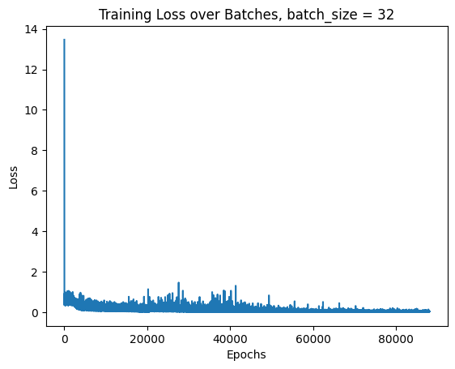
        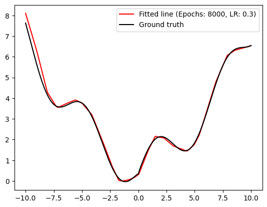
    </div>
</div>    
<div style="text-align: center";>
    <h4>
         Results Implemented by Stochastic Gradient Descent (SGD) Method
    </h4>
    <div style="display: flex; justify-content: center; align-items: center;">
        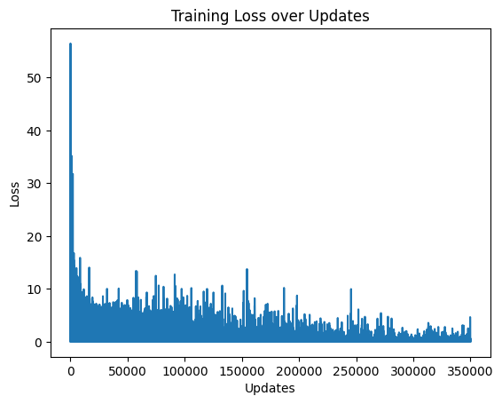
		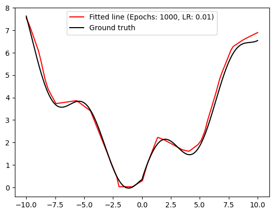
	</div>
</div>    
Empirically discovered, MBGD with bs=32, epochs=8000, lr = 0.3 is a good set of hyperparameters. We will do the cross validation part on it.

## Cross Validation

I implemented a k-fold cross validation method to evaluate the overall model.

```python
def train_k_fold(self, X, Y, k=5, epochs=None, lr=None):
        if epochs is None:
            epochs = self.epochs
        if lr is None:
            lr = self.lr

        m = X.shape[0]
        fold_size = m // k # integer division, i.e. 103 // 5 = 20
        indices = np.arange(m) # 0, 1, 2, ..., m-1
        np.random.shuffle(indices) # shuffle the indices, train randomly

        fold = 1
        for i in range(k): # iterate over the folds, totally we train for k times
            val_start = i * fold_size
            val_end = val_start + fold_size if i < k - 1 else m # if it's the last fold, use the remaining data

            val_indices = indices[val_start:val_end] # takes the validation indices
            train_indices = np.concatenate([indices[:val_start], indices[val_end:]]) # takes all the indices except the validation indices

            X_train = X[train_indices]
            Y_train = Y[train_indices]
            X_val = X[val_indices]
            Y_val = Y[val_indices]

            self.reset()
            self.train_MBGD(X_train, Y_train, epochs=epochs, lr=lr) # we still use the mini-batch gradient descent, with a default bs of 32.
            
            A_val = self.inference(X_val)
            loss = mse_loss(A_val, Y_val)
            self.validation_loss.append(loss)

            print(f'Fold {fold}, Loss: {loss}')
            fold += 1

```

It shuffles the x and y data and split them into 5 parts. The method then iterates over the number of folds(k). For each fold, it determines the start and end indices for the validation set. The remaining indices are used for the training set. This ensures that each fold has a unique validation set and the rest of the data is used for training. 

Within each fold, the method resets the model parameters to ensure that the training starts from scratch. It then trains the model using MBGD on the training set. After training, the model's performance is evaluated on the validation set using the inference method. The MSE loss is calculated for the validation set and appended to the [validation_loss list. The loss for each fold is printed to provide feedback on the training process.

```markdown
Training MBGD: 100%|██████████| 8000/8000 [00:11<00:00, 679.42it/s]
Fold 1, Loss: 0.135129258476114
Training MBGD: 100%|██████████| 8000/8000 [00:11<00:00, 704.24it/s]
Fold 2, Loss: 0.37937692480483626
Training MBGD: 100%|██████████| 8000/8000 [00:11<00:00, 703.15it/s]
Fold 3, Loss: 0.05067628846152356
Training MBGD: 100%|██████████| 8000/8000 [00:11<00:00, 716.51it/s]
Fold 4, Loss: 0.7495206586337292
Training MBGD: 100%|██████████| 8000/8000 [00:11<00:00, 704.32it/s]
Fold 5, Loss: 0.3724279561516599
```

<div style="text-align: center";>
    <h4>
         Training of 5 folds
    </h4>
    <div style="display: flex; justify-content: center; align-items: center;">
        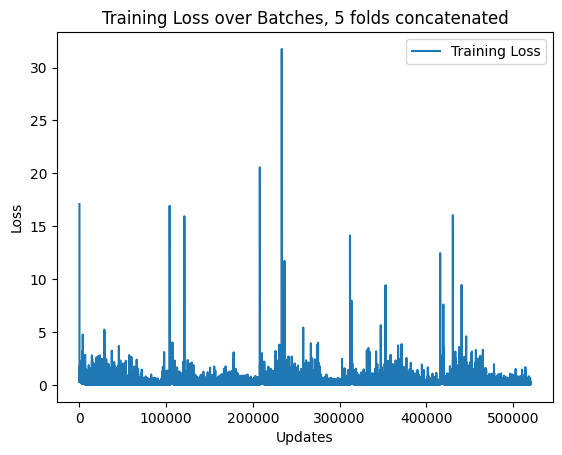
		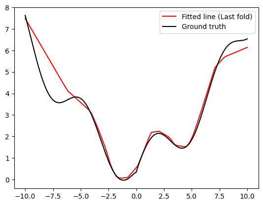
	</div>
</div>    

## Trying different Hyperparameters

## Test 1

```markdown
Average validation loss: 0.3374262173055726
Hyperparameters are: Epochs: 8000, LR: 0.4
Model structure: [<modules.Linear object at 0x7fd263aa6670>, <modules.ReLU object at 0x7fd263aa68b0>, <modules.Linear object at 0x7fd263aa6190>, <modules.ReLU object at 0x7fd263aa6070>, <modules.Linear object at 0x7fd263aa64c0>]
```

## Test 2 - Simpler Nets

```markdown
Average validation loss: 0.46817570040655837
Hyperparameters are: Epochs: 8000, LR: 0.4
Model structure:
Layer 1: Linear
Input size: 1, Output size: 128
Layer 2: ReLU
Layer 3: Linear
Input size: 128, Output size: 1
```

## Test 2 - Simpler Nets, extensive training

```markdown
Average validation loss: 0.3243354289653034
Hyperparameters are: Epochs: 15000, LR: 0.4
Model structure:
Layer 1: LinearInput size: 1, Output size: 128
Layer 2: ReLU
Layer 3: LinearInput size: 128, Output size: 1
```

## Test 3 - Deeper Nets

## Summary

- Deeper and wider nets are more difficult to train. 

```markdown
eval_layers = [
        Linear(input_size=1, output_size=128),
        ReLU(),
        Linear(input_size=128, output_size=256),
        ReLU(),
        Linear(input_size=256, output_size=512),
        ReLU(),
        Linear(input_size=512, output_size=1)
    ]
```

with a network like this, the speed is about **10~20 it/s**, while using a simpler net in simpler nets, the speed can go up to **~1700it/s**. 

```markdown
Training MBGD:   0%|          | 0/8000 [00:00<?, ?it/s]
Training MBGD: 100%|██████████| 8000/8000 [08:42<00:00, 15.32it/s]
Fold 1, Loss: 0.09874567588570843
Training MBGD:   0%|          | 0/8000 [00:00<?, ?it/s]/tmp/ipykernel_29773/4177186514.py:4: RuntimeWarning: overflow encountered in square
  return np.mean((predicted - target) ** 2)
/root/sdm274/assgn05_MLP/modules.py:45: RuntimeWarning: overflow encountered in matmul
  dW = (dZ.T @ X) / m # dZ.T ( output_size, m) @ X (m, input_size) = dW (output_size, input_size)
/root/sdm274/assgn05_MLP/modules.py:90: RuntimeWarning: invalid value encountered in multiply
  dZ = dA * (self.output_cache > 0).astype(float)
/root/sdm274/assgn05_MLP/modules.py:45: RuntimeWarning: invalid value encountered in matmul
  dW = (dZ.T @ X) / m # dZ.T ( output_size, m) @ X (m, input_size) = dW (output_size, input_size)
Training MBGD:  55%|█████▍    | 4396/8000 [04:29<03:41, 16.29it/s]
```

It is so resource-hungry that it might trigger **overflows**.

- Deep nets capture nonlinearities better, when properly trained.
- Shallow networks do not have enough layers to learn complex hierarchical features, making them less capable of capturing intricate nonlinear relationships. However, If you train them enough, you might have it yield a small validation loss, with the danger of overfitting.
- The improvement of accuracy is not proportionately big when you go from a normal model to a large model. The more accuracy you want, the more resources it takes to train and run a model.

- Hardware problem:

  

  What the program does is do tons of matrix multiplications for the training. It can cause the CPU to be fully loaded. But those matrix multiplications can be well accelerated by a GPU, which is suitable for computing simple calculations for millions of times.
