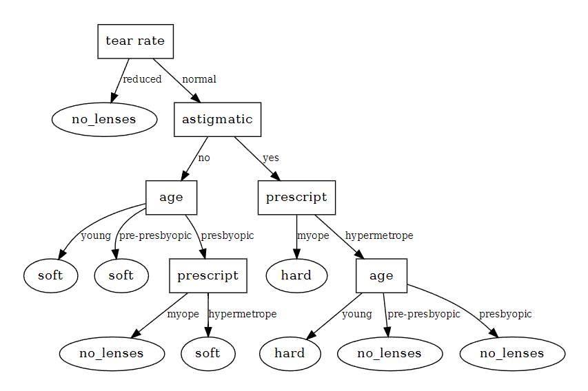

# Report on SDM 274 assignment 07 of Decision Tree

author: Ziyuan Li, 12211225

## 1. Configuring the environment

We use `conda` to configure our environment fast and simple. Here we continue to use the environment that we used for the former experiments with Python 3.9.20. 

In this experiment we use the `graphviz` library. It is an open-source graph visualization software used to represent structural information as diagrams of abstract graphs and networks, which is useful in demonstrating the structure of our decision tree.

In my wsl Ubuntu system, installing graphviz can be simply done by the command

```shell
sudo apt install graphviz
```

however, python cannot directly use the graphviz module installed in the linux system. We should do 

```shell
pip install graphviz
```

to install it in python. 

```
Python 3.9.20 (main, Oct  3 2024, 07:27:41)
[GCC 11.2.0] :: Anaconda, Inc. on linux
Type "help", "copyright", "credits" or "license" for more information.
>>> from graphviz import Digraph
>>> Digraph
<class 'graphviz.graphs.Digraph'>
```

## 2. Understanding the Decision Tree

The dataset we use here is all nominal. That means the values are all discrete and finite, which is very suitable to using a decision tree to help classify the result.

There are **three classes of labels**, and each data sample has **four features**. 

We define a `DecisionTree` class. It owns numerous `node` subclass instances to represent the whole data structure. `node` is defined by

```python
class Node:
        def __init__(self) -> None:
            # When a node a leaf node, then we use the output label as the value
            self.value = None
            # When a node is an internal node, then we use feature_index on it
            self.feature_index = None
            # Use a dictionary called children to indicate the children nodes, which contain {feature_value: node, }
            self.children ={}

        def __str__(self) -> str:
            if self.children:
                s = f'Internal node <{self.feature_index}>:\n'
                for fv, node in self.children.items():
                    ss = f'[{fv}]-> {node}'
                    s += '\t' + ss.replace('\n', '\n\t') + '\n'
            else:
                s = f'Leaf node ({self.value})'
            
            return s
```

There could be two types of nodes, a leaf node and an internal node. 

- an internal node has two key attributes: `feature_index` and `children`. Its children nodes are contained in the `children` dictionary.
- a leaf node has one key attributes `value`, that determines the result of the decision. 

Our decision tree automatically calculates the choice of feature that could maximize the decrease of the entropy of information. It does that by using the `_entropy()` method on given conditions:

```python
def _entropy(self, y):
        count_y = np.bincount(y)
        prob_y = count_y[np.nonzero(count_y)] / y.size
        entropy_y = -np.sum(prob_y * np.log2(prob_y))
        return entropy_y
```

The class calculates the entropy of the output label and the conditional entropy of the output label given a specific entrop, then subtract them, deriving the Information gain of a feature.
$$
IG(X)=H(Y)−H(Y∣X)
$$
The `_build_tree` method recursively selects features from the dataset. It creates a node, uses the label with most values as a default prediction value, and then uses the `select_feature` method to find the feature with the highest information gain. It divides the dataset using the selected feature, then recursively use the method itself for the sub node to create the whole decision tree. 

We use the `train()` method to build the decision tree for the dataset. Below is the derived tree:

```
Internal node <3>:
        [1]-> Leaf node (3)
        [2]-> Internal node <2>:
                [1]-> Internal node <0>:
                        [1]-> Leaf node (2)
                        [2]-> Leaf node (2)
                        [3]-> Internal node <1>:
                                [1]-> Leaf node (3)
                                [2]-> Leaf node (2)

                [2]-> Internal node <1>:
                        [1]-> Leaf node (1)
                        [2]-> Internal node <0>:
                                [1]-> Leaf node (1)
                                [2]-> Leaf node (3)
                                [3]-> Leaf node (3)
```

a Leaf node means the sample is classified definitely at the point. An Internal node indicates that the data is further split by other features. For example, this tree means that the tree firstly looks at the feature **indexed as** **3**. If this index has the **value 1**, then the data point is classified as **class 3**. Else if this index has **value** **2**, the data point will be classified further on its featured indexed as **2**. It is the same for the deeper structure of the tree. 

We also use a `decisiontreeplotter` class to plot the decision tree in more human-readable format.



```python
# Predict the labels for the first 5 data points
predictions = dt01.predict(X[:5])
print(predictions)
print (y[:5])

# Calculate the accuracy of the model
accuracy = np.mean(predictions == y[:5])
print(accuracy)

-----------------
[3 2 3 1 3]
[3 2 3 1 3]
1.0
```

As shown above, for simple datasets with all nominal values, it is easy for decision tree to achieve high accuracy.

